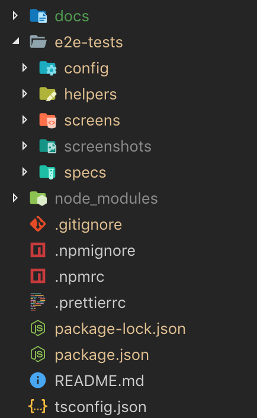

## Quick Links

It will be a long read to understand how we setup E2E test, but don't worry, you can quickly find the necessary
information with the links as below:

- 📖 [Technology stacks](#technology-stacks)

- ✅ [Installation](#installation)

- ⚒️ [Testing Strategy Configuration](#testing-strategy)

- 🔍 [Locating element strategy](#locators-and-finding-elements)

- 🔨 [Debugging](./docs/debugging.md)

- 🔧 [Troubleshooting](./docs/troubleshooting.md)

---

## **Testing Mechanism**

- Build the latest version of your iOS app with Ionic and needs to deploy into an iOS simulator/ physical device using
  XCode. This build must NOT be an Production build and must NOT be singed by distribution provisioning profile.

- Prepare the test cases (also test suites)

- Configure Appium server (a wrapper of Selenium web server), which connects with an iOS simulator/ physical iOS device
  and listens to Selenium protocol (WebDriver protocol) in a special format (MJSONWP / JSONWP HTTP Requests). This
  server sits and waits for connections from a client, which then instructs what kind of session to start and what kind
  of automation behaviors needed to enact once a session is started, and send the status back to the automation script.

- Run the tests with WebdriverIO (which also start Appium server).

- The respective reporter will list out the total number of successful and failed cases. Failed test cases might be
  recorded with screenshots.

## **Technology Stacks**

| Stack | Description |
| --- | --- |
| **`Appium`** | Because we are using Ionic with Cordova, we can write our codebase using only web technologies but still build, deploy and run on multiple platforms. Our mobile appligcation can be packaged and deployed as a native application for both iOS and Android. We can achieve the same cost-savings strategy “Write once, run anywhere” for our UI tests using Appium. To automate our UI tests, there needs to be an agent that programmatically drives the UI of your mobile application. For each platform, there are different agents. </br> For iOS: UIAutomation (only available on iOS simulators and devices that are running iOS 9.3 or lower and Appium all version) and `XCUITest` (only available on iOS simulators and devices that are running iOS 9.3 or higher and starting with Appium 1.6). </br> Controlling these agents requires a developer to write platform-specific code. Appium with MJSONWP (Webdriver spec) provides an abstraction layer to drive these agents programmatically in a platform agnostic way. |
| **`WebdriverIO`** | It is the Selenium Webdriver API bindings for node.js. It has a very simple API which could be used to automate web & browser apps in a fast and scalable way. Please notice that we are using WebdriverIO version 5 which is likely containing break changes to its version 4. |
| **`Typescript`** | It is the superset of javascript which has additional static typing and features like JAVA and other languages. Now you could write your code which compiles to pure javascript. |
| **`Jasmine`** | The popular BDD test framework which helps us write automated tests. |

## **Installation**

### **Prepare pre-requisites for Mac OS**

- `Xcode` 10.x.x or higher installed globally.

- `brew` as the package manager on MacOS:

  ```bash
  $ /usr/bin/ruby -e "$(curl -fsSL https://raw.githubusercontent.com/Homebrew/install/master/install)"
  ```

  Let check that `brew` has been successfully installed:

  ```bash
  $ brew -V
  ```

- You are now in shape to install `Node.js` (incl. `npm`) from `brew`:

  ```bash
  $ brew install node
  ```

  Lastly, check that Node.js and npm have been successfully installed:

  ```bash
  $ node -v

  $ npm -v
  ```

### **Install required NPM packages**

| Package | Version | README | Description |
| --- | --- | --- | --- |
| [`appium`](https://www.npmjs.com/package/appium) | [](https://badge.fury.io/js/appium) | [](https://github.com/appium/appium/blob/master/README.md) |  |
| [`webdriverio`](https://www.npmjs.com/package/webdriverio) | [](https://badge.fury.io/js/webdriverio) | [](https://github.com/webdriverio/webdriverio/blob/master/README.md) |  |
| [`@types/jasmine`](https://www.npmjs.com/package/@types/jasmine) | [](https://badge.fury.io/js/%40types%2Fjasmine) |  |  |
| [`@types/node`](https://www.npmjs.com/package/@types/node) | [](https://badge.fury.io/js/%40types%2Fnode) |  |
| [`@wdio/appium-service`](https://www.npmjs.com/package/@wdio/appium-service) | [](https://badge.fury.io/js/%40wdio%2Fappium-service) | [](https://github.com/webdriverio/webdriverio/blob/master/packages/wdio-appium-service/README.md) | Run Appium server as long as the test runs without a need of separate initialization. |
| [`@wdio/cli`](https://www.npmjs.com/package/@wdio/cli) | [](https://badge.fury.io/js/%40wdio%2Fcli) | [](https://github.com/webdriverio/webdriverio/blob/master/packages/wdio-cli/README.md) | Launch the helper utility to initialize WebdriverIO's configuration. |
| [`@wdio/config`](https://www.npmjs.com/package/@wdio/config) | [](https://badge.fury.io/js/%40wdio%2Fconfig) | [](https://github.com/webdriverio/webdriverio/blob/master/packages/wdio-config/README.md) | Launch the helper utility to parse and verify options in WebdriverIO's configuration. |
| [`@wdio/jasmine-framework`](https://www.npmjs.com/package/@wdio/jasmine-framework) | [](https://badge.fury.io/js/%40wdio%2Fjasmine-framework) | [](https://github.com/webdriverio/webdriverio/blob/master/packages/wdio-jasmine-framework/README.md) | Write and run test spec with Jasmine framework. |
| [`@wdio/local-runner`](https://www.npmjs.com/package/@wdio/local-runner) | [](https://badge.fury.io/js/%40wdio%2Flocal-runner) | [](https://github.com/webdriverio/webdriverio/blob/master/packages/wdio-local-runner/README.md) | Run automated tests on local device. |
| [`@wdio/dot-reporter`](https://www.npmjs.com/package/@wdio/dot-reporter) | [](https://badge.fury.io/js/%40wdio%2Fdot-reporter) | [](https://github.com/webdriverio/webdriverio/blob/master/packages/wdio-dot-reporter/README.md) | Run automated tests with dot reporter. |
| [`@wdio/spec-reporter`](https://www.npmjs.com/package/@wdio/spec-reporter) | [](https://badge.fury.io/js/%40wdio%2Fspec-reporter) | [](https://github.com/webdriverio/webdriverio/blob/master/packages/wdio-spec-reporter/README.md) | Run automated tests with spec reporter. |
| [`@wdio/sync`](https://www.npmjs.com/package/@wdio/sync) | [](https://badge.fury.io/js/%40wdio%2Fsync) | [](https://github.com/webdriverio/webdriverio/blob/master/packages/wdio-sync/README.md) | Overwrite global functions depending on the test framework in order to make commands of WebdriverIO using the Wdio testrunner synchronously. <br/> We highly recommend applying this package to avoid hassle of [having to many `async` and `await` modifier in each function](https://webdriver.io/docs/api.html#examples) of the test case. |
| [`appium-doctor`](https://www.npmjs.com/package/appium-doctor) | [](https://badge.fury.io/js/appium-doctor) | [](https://github.com/appium/appium-doctor/blob/master/README.md) | Check most of preconditions to run Appium successfully. |

### **Define NPM tasks**

```js
{
	 // compile test source from Typescript to Javascript
	"build" "tsc",

	// remove the compiled test folder before running a new test run
	"clean": "rimraf dist/ && rimraf logs/**/*.log  && rimraf tmp/**/*.*",

	"clean-build": "npm run clean && npm run build",

	// "appium": "appium", - we no longer need this task as per included in wdio.config.js

	// run Appium conformity
	"appium-doctor": "appium-doctor --ios",
	
	// format code of whole project Prettier follow by clean up all temporary dirs
	"pretest": "npm run prettier && npm run clean-build",

	// run our tests with configured Strategies
	"test": "node config/app.js"
	
	// format the source code
	"prettier": "prettier --config .prettierrc --write \"{src,config}/**/*.{ts,js,json}\""
}
```

### **Set up Appium (with all external tool's and components)**

If we already have `brew` successfully installed from the above steps, now execute the below-listed statements to
install required packages/dependencies:

> TL;DR: Run the command below to get full automation setup for all below steps:

```bash
$ sh ./scripts/install-packages.sh
```

#### Step-by-step guide

1. **`carthage`**: to add frameworks to Cocoa applications

    ```bash
    $ brew install carthage
    ```

   Please do not install `carthage` from HEAD to avoid unexpected alike
   exception: `Error: Xcode >=10.2 requires macOS >=10.14.4 to build Swift formulae.`

2. **`usbmuxd`**: to run our tests in multiple connected real iOS devices, which barely requires establishing a socket
   daemon to multiplex connections.

    ```bash
    $ brew install --HEAD usbmuxd
    ```

3. **`libimobiledevice`**: A cross-platform protocol library to communicate with iOS devices
    ```bash
    $ brew install --HEAD libimobiledevice
    ```

4. **`ideviceinstaller`**: to install, uninstall, upgrade, archive, restore and enumerate installed or archived apps.

    ```bash
    $ brew install --HEAD ideviceinstaller
    ```

   Even though this command will also install its dependency `libimobiledevice` (**1.2.0**) - allow us to run our tests
   on real iOS devices, another sole installation of `libimobiledevice` is still neccessary to rebuild utility with the
   latest **HEAD**.

5. **`ios-webkit-debug-proxy`**: to send commands to MobileSafari and UIWebViews on real iOS devices.

    ```bash
    $ brew install -s ios-webkit-debug-proxy
    ```

6. **`deviceconsole`**: watch a connected iOS device or the iOS Simulator's system log

   ⁉️ **NOTICE**: From [rpetrich/deviceconsole](https://github.com/rpetrich/deviceconsole), this formula actually uses a
   fork by cbowns because it has a few more features. Since `deviceconsole` has never been given proper releases and
   versions, you must install with --HEAD:

   Before all, add the repo to your system with:

    ```bash
    $ brew tap hbang/repo
    ```

   then you can install the formula with:

    ```bash
    $ brew install --HEAD hbang/repo/deviceconsole
    ```

   ➡️ ➡️ ➡️ Please have a look at [this Github issue](https://github.com/libimobiledevice/libimobiledevice/issues/775)
   if you experienced any installation complexity while walking from step 1 to step 4.

7. **`xcode-select`**: a command-line utility facilitates switching between different sets of command line developer
   tools using Xcode.

    ```bash
    $ xcode-select --install
    ```

8. **`ios-deploy`**: to install and debug apps from the command-line without using Xcode.

    ```bash
    $ brew install ios-deploy
    ```

9. **`fastlane`**: to enable Automatic Signing and update bundle identifier for Appium's WebDriverAgent
    ```bash
    $ brew cask install fastlane
    ```

Optional packages/dependencies (as suggested by appium-doctor):

9. **`applesimutils`**: a collection of utils for iOS simulators.

    ```bash
    $ brew tap wix/brew

    $ brew install wix/brew/applesimutils
    ```

### **Check Appium conformity**

➡️ ➡️ ➡️ Please cross check with Appium Doctor after all of above steps and fix any remaining issues (if any).

```bash
$ npm run appium-doctor
```

### **WebdriverIO configuration**

If running `appium-doctor` gave a 👍, then we could start setting up the Wdio config file. Either using the config file
generated by `@wdio/cli` or making a custom one for self-learning purpose.

You only need to go through possible options listed in each section of WebdriverIO docs. The result will be saved in
the `wdio.conf.js` file. It is a plain Javascript file that should return a configuration object. If you already worked
with Karma or Webpack, you will find this configuration style very similar.

## Testing Strategy

### Basic Appium desired capabilities

➡️ ➡️ ➡️ Some capabilities must be set correctly to ensure Appium can connect properly:

- `appiumVersion` - version of target Appium.

- `simulator` - leave this true if automating on simulators.

- `browserName` - name of the mobile web browser to automate. Leave this empty if automating using embedded Webview
  context instead.

- `autoWebView` - true for hybrid applications.

- `automationName` - automation engine to use (XCUITest for iOS).
- `language` - language to set for iOS (XCUITest driver only).

- `locale` - locale to set for iOS (XCUITest driver only). 'en_GB' format for iOS.

- `platformName` - mobile OS platform to use (eg. 'iOS').

- `platformVersion` - mobile OS version version (eg. '12.2').

- `deviceName` - name of mobile device or emulator to use.

- `udid` - unique device identifier of the connected simulator/physical device.

- `app` - absolute local path or remote http URL to `.app` (simulator) or `.ipa` (real device).

  The exact location of the `.app` build may change depending on XCode's preference settings. For local development, we
  can force XCode to deliver build products in specific folder by: start `XCode` > go to `Project Settings...` >
  see `Per-User Project Settings` > select `Advanced...` (in Derived Data) > select `Custom` and fill in customized
  folder path.

- `bundleId` - bundle ID of the app under test. Useful for starting an app on a real device or for using other caps
  which require the bundle ID during test startup.

- `enablePerformanceLogging` - (Web and webview only) enable Safari's (on iOS) performance logging.

Without providing any `xcodeOrgId` & `xcodeSigningId` capabilities, Appium will take the respective simulator instead.

In particular, this takes more effort to run automation test in parallel on mutiple real devices and when we need to
justify the below capabilities:

> `udid`: as with Android, we need to make sure we specify a particular device id to ensure we don't try to run a session on the same device. For simulators, udids can be found by running xcrun simctl list devices. Actually, if you're doing simulator testing, I should have said that either the udid capability is required, or a distinct combination of the deviceName and platformVersion capabilities is required. See below...

> `deviceName` and `platformVersion`: if you specify a unique combination of device name and platform version, Appium will be able to find a unique simulator that matches your requirement, and in this case you don't need to specify the udid.

> `wdaLocalPort`: just as with UiAutomator2, the iOS XCUITest driver uses a specific port to communicate with WebDriverAgent running on the iOS device. It's good to make sure these are unique for each test thread.

> `webkitDebugProxyPort`: for webview and Safari testing on real devices, Appium runs a small service called ios-webkit-debug-proxy, which mediates connections on a specific port. Again, make sure multiple test threads are not trying to speak to this service on the same port.

### Testing Strategy for team Hanuman's projects

With Testing Strategy, you are able to achieve running Automation Test:

1. On many projects on **single code base**.
2. **In parallel** for a specified project
3. **In sequence** for multiple projects.
4. **In parallel** for a specified project on different devices
5. ...

➡️ ➡️ ➡️ Please refer to our separate documentation about [automation testing strategy](docs/testing-strategies.md) for
specific testing configuration of team Hanuman's projects.
 
---

⁉️ **NOTICE:** To check which iOS connected devices/simulators you have installed, just execute the following commands
in your terminal:

```bash
$ instruments -s device
```

For adding more simulators or emulators to the list, launch Xcode and select Xcode > Preferences > Components to install
necessary simulators that you might want to test against.

---

## **Appium Desktop** (Optional)

[Appium Desktop](https://github.com/appium/appium-desktop) is a graphical user interface for running an Appium server
and starting sessions to inspect your applications.

Appium Desktop has two advantages:

- It comes with an inspector to show and inspect all elements of your application.

- Record user actions.

⁉️ **NOTICE:** The drawback is inspecting and recording user actions only support the Native context. You cannot record
actions for the Webview context. Cordova applications always run in the Webview context. Can view the reference
article [here](https://ordina-jworks.github.io/ionic/2018/09/30/e2e-testing-ionic-protractor-appium-e2e-testing.html)

## **Project Structuring**



### **Screen Objects**

There are a
few [best practices](https://www.pluralsight.com/guides/getting-started-with-page-object-pattern-for-your-selenium-tests)
following screen (or page) objects pattern that we should make an effort to follow:

- Screen object should not have any assertions.

- A screen object should represent meaningful contextual elements of a screen and not necessarily a complete screen.

- ~~When you navigate you should return the page object for the next page~~.

  😩 We found it hard to return screen object whenever completing an action from the previous screen so we just skip
  this technique.

### **Specs**

Inside `e2e-tests` folder, we create another folder `specs` that contain all test cases with
pattern `<test_name>.spec.ts`.

### **Reports**

The test result can be seen with dot and spec styles.

## **Test Cases**

### **Write tests**

Jasmine framework has been integrated with this project, WebdriverIO's `@wdio/jasmine-framework` adapter helps write
specific test cases.

### **Run tests**

You only need to execute commands with respective profiles:

```bash
npm run test:simulator
```

or

```bash
npm run test:device
```

The above command, which is set in `package.json`, internally calls the WebdriverIO's
binary `wdio ./config/wdio.config.js` that runs the app config file, starts the Appium server and also directly
configure the test profiles.

➡️ ➡️ ➡️ Please beware that the first run might take minutes while Appium prepares the device, but subsequent tests will
be faster. If all goes well, you will see the tests running on your device.

➡️ ➡️ ➡️ Failed test cases will be taking an app screenshot and handled by Jasmine test framework.

## **Locators and finding elements**

The locator can be termed as an address that identifies an element uniquely within hybrid mobile apps running Web view.
Locators are the HTML properties of a web element which tells the Selenium about the web element it needs to perform the
action on.

📣 RECOMMENDED - easier & hassle free: finding elements via [**CSS query
selectors**](https://webdriver.io/docs/selectors.html#css-query-selector) (using **Remote debugging with Chrome
DevTools**). Among any selectors, identifier (id) is unique and permanent which provides significantly faster locating
for each element and traverse fewer elements.

📣 However, not every element has an id declared (depends on the specific application implementation), then [**
XPath**](https://webdriver.io/docs/selectors.html#xpath) (using XML path expression) is used in particular and even more
efficient if dealing with native iOS elements.

> Using XPath locators is not recommended and can lead to fragile tests. Ask your development team to provide unique accessibility locators instead.

To support XPath, yet another complex method can be used is locating elements using [**iOS predicate string and class
chain**](http://appium.io/docs/en/writing-running-appium/ios/ios-predicate/index.html)

Above all, some native events are only supported in the Native context. Therefore, remember to switch between
appropriate contexts since locating and interacting with UI elements are very different in each.

## **Reporters**

1. **Spec Reporter**

   The larger the test suite, the more difficult it is to identify which test passed and which is failing with this
   summary report. To displays more detailed information about running the tests, as well as having some customization
   options, we opted in `spec` option (via `@wdio/spec-reporter`). If there are successful tests, failed tests or
   pending tests, the terminal could display a result properly in the Terminal.

2. **Instanbul Reporter (Promising)**

   UI Automation is costly in terms of building and maintenance. A right measure of these suites would ensure we are not
   ending up with heavy maintenance state without knowing the actual ROI (the Return on Investment).

   A perfect state would be to know the value what these tests provide and quantify them to understand the actual ROI.
   To achieve this, we used `babel-plugin-istanbul` and follow the below approach:

- **Build & serve with Istanbul instrumentation**. We get the code prepared for providing useful insights on the test
  automation code written for the selected features.

- **Run test suite**. We have a suite of tests to run against the instrumented code.

- **Generate coverage after each test**. We leverage the afterTest() hook from WebdriverIO and capture the **coverage**
  object once every test is completed. Coverage object thus captured is added to an array of coverageObjects at this
  step.

- **Merge the overall coverage.** At the end of the entire suite, we merge all the coverage information from the
  coverageObjects and instruct Istanbul to generate readable reports. Istanbul provides various formats of reports
  generation. In our case, we have opted in `html` option that allows Instanbul to generate the coverage and represent
  that in a readable HTML file.

## **Debugging**

Please refer [here](./docs/debugging.md).

## **Troubleshooting**

Please refer [here](./docs/troubleshooting.md)
