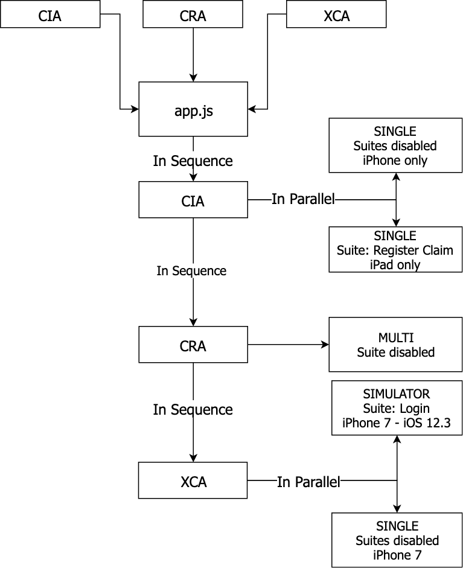

# Automation Test Strategies

## Approach to parallel testing solution

To approach parallel mobile execution with Appium and iOS, the general idea is to connect as many devices as possible to
a machine (the number of connected devices is restricted by the number of USB ports), deploy the app on all connected
devices and run Appium tests that will be executed against the target app on all devices in parallel.

### Initial problem

We encountered one major limitation: only one instance of Apple Instruments can be run on macOS. Since Appium uses Apple
Instruments underneath to run tests against an iOS app, that meant we are unable to spin up multiple Appium server
instances on a single machine. We could spawn multiple Appium server instances (just like in the case of Appium/Android)
, but all of them would connect to the same Instruments instance (i.e. one iOS device per machine).

### Proposed approach

Thanks **Atlantbh**
for [their sufficient approach](https://www.atlantbh.com/blog/blog-parallel-mobile-testing-appium-part-2-ios/)

> In short, mobile devices are connected to a USB port. When the [ios_runner_sh](https://github.com/ATLANTBH/testing-research/blob/master/parallel_mobile_execution/ios/ios_runner.sh) script is executed, it invokes the number of Appium server instances that is equal to the number of UDIDs and then executes the test script for each UDID (each real device). Each Appium server instance invokes one Instruments instance to communicate with a real device, which has its own tmp file for intermediate operations.

The detail is described as below:

1. Discover all `UDID`s using the system_profiler tool (in other words, discover the IDs of the connected iOS devices).

2. Deploy the app using `ios-deploy` tool on all connected devices (`ios-deploy` tool is basiclly a helper tool for iOS
   apps deployment using command line without Xcode’s cumbersome cli tools).

3. Based on the number of `UDID` devices, spawn an equal number of Appium server instances with one subtle but important
   difference: specifying the instrument’s output temporary file (to spawn multiple instrument instances and have each
   Appium server work with a different instrument instance, you need to specify different tmp files for the instrument’s
   output. This is done using the `–tmp` flag).

    ```bash
    $ appium -p PORT --webdriveragent-port WDALOCALPORT –tmp
    ```

   Default PORT value is 4723 and default WDALOCALPORT value is 8100. To run another Appium server, use another port and
   wdalocalport value instead, e.g. 4724 and 8200.

4. Set Appium capabilities to reflect kind of test we intend to run.

5. Start script tests (relied on Jasmine framework) for each combination of UDID and Appium server instance ports.

6. Clean up the environment by shutting down Appium server instances once all tests have been completed.

As recommended by Atlantbh, it's ideal to try out in-house parallelization solution (and see how tests work in general)
at no charge and then decide to shift towards cloud mobile providers if we need more infrastructure.

> More reading can be found at [testing on real iOS devices with XCUITest](http://appium.io/docs/en/drivers/ios-xcuitest-real-devices/) and also [iOS parallel testing capabilities](https://appiumpro.com/editions/28)

## Connecting the puzzle: testing multiple apps on multiple devices parallelly with a single codebase

At team Hanuman, we have 3 production apps and an ongoing development. Regression work on each (before release in
particular) would be time consuming to undertake. Borrowing parallel testing approach, we can now resolve this prolem,
but sadly it can only be applicable for **ONE** app.

To make it available for multiple projects, we consider the fact that we share lots of similiar components across our
apps: authentication, searching for Claims and Partners ... It can be a massive advantage if we can reuse them all
during our automation test.

All steps is conceptualized as below:

1. Discover **UDIDs** of all connected (iOS) devices.

2. Each app will match an auto-generated configuration (JSON file). This contains some basic information as below:

    - Identity info (**Team ID**, **Signing Identity**)

    - App info (**Bundle ID**, **.ipa** file for physical device or **build file** for simulator)

    - List of testing strategy that will be used/ran on this app. Each strategy will be ran in parallel. User can
      enable/disable the strategy, depends on their needs.

3. Depends on the pre-defined **Bundle ID**, the script will look into exact spec directory associated with this id. For
   example, if the **Bundle ID** is `ch.mobiliar.CIA`, only spec files in directory `/src/apps/ch.mobiliar.CIA` will be
   executed.

4. Automation test for available apps will be executed in sequence, one after another.

5. Automation test for each app will also be ran parallelly on multiple devices.

## How we automate test on our apps

Finally, we provide our in-house solution for:

- Parallel automation test.

- Multiple projects configurations.

- Running test cases depends on selected strategy: whole projects or just specified test cases (Test suites)



### Strategy interpretation

1. First, please take a look at the below sample:

    ```json
    {
        "xcodeOrgId": "VXMWK5649M",
        "xcodeSigningId": "iPhone Developer",
        "bundleId": "ch.mobiliar.CRA",
        "appPath": "/Users/quangpham/Documents/IPA/Claim Registration App.ipa",
        "simulatorAppPath": "/Users/quangpham/Documents/IPA/Claim.app.zip",
        "strategies": [
            {
                "debug": false,
                "enabled": true,
                "mode": "SINGLE",
                "deviceName": "NVG iPad Pro - Quang Hanuman",
                "useSuites": false,
                "suites": {
                    "login": {
                        "enabled": true,
                        "testCases": ["login.spec.js"]
                    },
                    "registerClaimCasesForIPad": {
                        "enabled": true,
                        "deviceType": "iPad",
                        "testCases": ["workflow/register-claim-cases.ipad.spec.js"]
                    }
                }
            },
            {
                "debug": true,
                "enabled": true,
                "mode": "MULTI",
                "useSuites": true,
                "suites": {
                    "login": {
                        "enabled": true,
                        "testCases": ["login.spec.js"]
                    },
                    "registerClaimCasesForIPad": {
                        "enabled": true,
                        "deviceType": "iPad",
                        "testCases": ["workflow/register-claim-cases.ipad.spec.js"]
                    }
                }
            },
            {
                "debug": true,
                "enabled": false,
                "mode": "SIMULATOR",
                "simulatorName": "iPad Pro (9.7-inch)",
                "simulatorUDID": "AE1B176F-7147-47FF-B082-12FEB42ADB46",
                "simulatorType": "iPad",
                "simulatorIOSVersion": "12.2"
            }
        ]
    }
    ```

2. This file is named as `ch.mobiliar.CRA` and located at `/config/strategies`

   > **WHY?** We name our apps in automation test with the agreed prefix `ch.mobiliar` to help us easily identify each app.

3. From the above config file, we can some basic information about testing app:

    - Identity info (Team ID & Signing Identity)

    - App info (Bundle ID, IPA file for device and ZIP file for Simulator)

4. We do have 3 strategies, the first one is `enabled` and the rest are `disabled`, depends on value of `enable`
   property. All of them are configured under `debug` mode.

5. Now let interpret important points in each strategy:

    - First strategy: `SINGLE` mode - a single physical iOS device naming `NVG iPhone 6S Plus - Quang Hanuman` should be
      attached, otherwise the automation test is skipped/terminated. Although this strategy has defined `suites` but the
      flag `useSuites` is `false` - which means no suite will be activated, otherwise looked up and ran all spec files
      in `/src/apps/ch.mobiliar.CRA`.

    - Second strategy (will be triggered when the first one is done): `MULTI` mode - any attached devices is counted, if
      no device recognized then the automation test is skipped/terminated. This time, `useSuites` flag is `true` - which
      means only test cases matching with configurations will be triggered. Remarkably, the
      suite `registerClaimCasesForIPad` is for iPad only. If there is 2 connected devices: 1 x iPhone and 1 x iPad. The
      test suite `login` will be run on both devices, but `registerClaimCasesForIPad` can only be ran on iPad.

    - Third strategy (will be triggered lastly): `SIMULATOR` mode - no physical devices required but simulator
      information: `simulatorName`, `simulatorUDID`, `simulatorType`, `simulatorIOSVersion`.

### Running automation test with generated strategy

To run automation test for CRA app, run the following NPM script:

```bash
$ npm run test CRA
```

This command will start with `/config/app.js` and read all necessary definition
from `/config/strategies/ch.mobiliar.CRA`.

To run automation test for multiple apps in sequence:

```bash
$ npm run test CRA && npm run test CIA
```

We also need to create a separated config file for new apps, for example, `ch.mobiliar.CIA.json` and put it
into `/config/strategies/` dir, same place with `ch.mobiliar.CRA.json` file beforehand.

### Notes

- If there is a strategy running with `MULTI` mode, it should be the only **enabled** one. In other words, this setting
  will override any other strategy.

- If strategies are ran parallelly, we cannot control the test case/test suite running on single device at the same
  time.

### Tips

To optimize the configuration and help speed up your regression work, please follow some tips as below:

1. Run different Test suites on the same app, on different devices, parallelly: with `SINGLE` mode

   > Let's say we want to run only the Test suite `Register Claim Case` workflow only on iPhone, and all test cases should be run on iPad. Let's solve the math!

    - Define 2 strategies in `SINGLE` mode, one for iPhone and one for iPad.
    - Define device name for each strategy.
    - Enable `useSuites` for iPhone's strategy.
    - Disable or remove all parts related to Test suite in iPad's strategy.
    - The strategy should look like:

    ```json
    {
        "xcodeOrgId": "VXMWK5649M",
        "xcodeSigningId": "iPhone Developer",
        "bundleId": "ch.mobiliar.CRA",
        "appPath": "/Users/quangpham/Documents/IPA/Claim Registration App.ipa",
        "simulatorAppPath": "/Users/quangpham/Documents/IPA/Claim.app.zip",
        "strategies": [
            {
                "debug": true,
                "enabled": true,
                "mode": "SINGLE",
                "deviceName": "NVG iPhone 6S Plus - Quang Hanuman",
                "useSuites": true,
                "suites": {
                    "registerClaimCasesForIPhone": {
                        "enabled": true,
                        "deviceType": "iPhone",
                        "testCases": ["workflow/register-claim-cases.iphone.spec.js"]
                    }
                }
            },
            {
                "debug": true,
                "enabled": true,
                "mode": "SINGLE",
                "deviceName": "NVG iPad Pro - Quang Hanuman"
            }
        ]
    }
    ```

2. Run different Test Suites for the same app, on different devices, sequentially: with `MULTI` mode

Following up the above notice that we cannot have 2 `MULTI`-mode strategies running parallelly. Having said that, we
still can run them in sequence. All we need is to create 2 different files for the same app, but with different
strategies.

Configuration for first file: `ch.mobiliar.CRA_1`

```json
{
    "xcodeOrgId": "VXMWK5649M",
    "xcodeSigningId": "iPhone Developer",
    "bundleId": "ch.mobiliar.CRA",
    "appPath": "/Users/quangpham/Documents/IPA/Claim Registration App.ipa",
    "simulatorAppPath": "/Users/quangpham/Documents/IPA/Claim.app.zip",
    "strategies": [
        {
            "debug": true,
            "enabled": true,
            "mode": "MULTI",
            "useSuites": true,
            "suites": {
                "registerClaimCasesForIPhone": {
                    "enabled": true,
                    "deviceType": "iPhone",
                    "testCases": ["workflow/register-claim-cases.ipad.spec.js"]
                },
                "registerClaimCasesForIPad": {
                    "enabled": true,
                    "deviceType": "iPad",
                    "testCases": ["workflow/register-claim-cases.ipad.spec.js"]
                }
            }
        }
    ]
}
```

Configuration for second file: `ch.mobiliar.CRA_2`

```json
{
    "xcodeOrgId": "VXMWK5649M",
    "xcodeSigningId": "iPhone Developer",
    "bundleId": "ch.mobiliar.CRA",
    "appPath": "/Users/quangpham/Documents/IPA/Claim Registration App.ipa",
    "simulatorAppPath": "/Users/quangpham/Documents/IPA/Claim.app.zip",
    "strategies": [
        {
            "debug": true,
            "enabled": true,
            "mode": "MULTI"
        }
    ]
}
```

Then run the below command in Terminal:

```bash
$ npm run test CRA_1 && npm run test CRA_2
```

The first strategy will only run Test Suite `registerClaimCasesForIPhone` for iPhone, and `registerClaimCasesForIPad`
for iPad, and complete when passed/failed. The second one will be triggered right after that.

**Notes**

Of course, the second strategy will repeat all the test cases that passed/failed in the previous one. But this is only
an example. So please don't take it seriously 😛.
